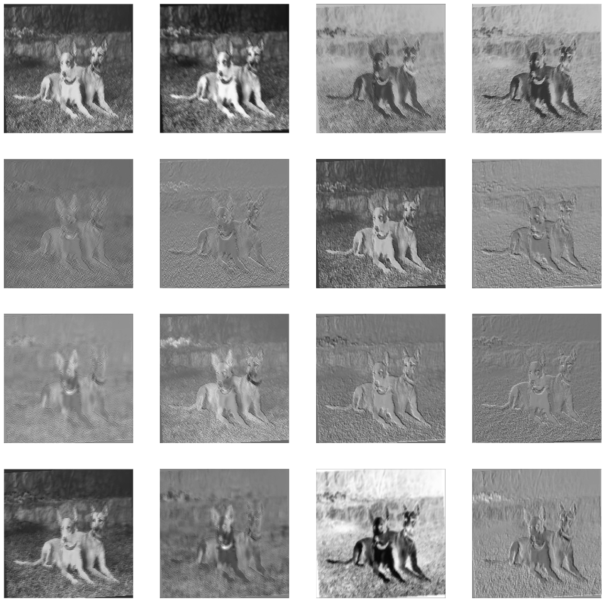

# 卷积神经网络

## 简介

`CNN_utils.py` 文件包括名为 `DogDataset`、`CNN`的类，用于实现一个简单的CNN（卷积）神经网络。该类调用`torch.nn.Module`以完成网络模型构建、反向传播、参数更新、特征图可视化等功能。

## 依赖

- torch
- torchvision
- matplotlib

## 类结构

### CNN

该类包括以下方法：

- `forward(self,x:torch.Tensor) -> torch.Tensor`  用于前向传播
- `hook_fn(self,m:torch.nn.Module,i,o)`  特征图钩子函数
- `show_feature_map(self,images:torch.Tensor)`:  可视化特征图
- `get_feature_maps(self,layer_name:str)` 获取特征图张量

## 示例

以下是如何使用该类的示例：

```python
%load_ext autoreload
%autoreload 2

import torch
import torch.nn.functional as F
import os
from torch.optim import Adam
from torch.utils.data import random_split
from matplotlib import pyplot as plt
from torch.utils.data import DataLoader
from torchvision import transforms
from utils.CNN_Utils import *

# 模型训练
model = CNN()
model.to(device)

criterion = torch.nn.CrossEntropyLoss()
optimizer = Adam(model.parameters(), lr=0.001)

for epoch in range(10):
    for images, labels in train_loader:
        images,labels = images.to(device),labels.to(device)
        optimizer.zero_grad()
        outputs = model(images)
        loss = criterion(outputs, labels)
        loss.backward()
        optimizer.step()

# 模型评估

model.eval()

correct = 0
total = 0

with torch.no_grad():
    for images, labels in test_loader:
        images,labels = images.to(device),labels.to(device)
        outputs = model(images)
        _, predicted = torch.max(outputs.data, 1)
        total += labels.size(0)
        correct += (predicted == labels).sum().item()

accuracy = 100 * correct / total
print('Accuracy: {}%'.format(accuracy))

# 特征图可视化
model.show_feature_map(model.get_feature_maps('conv1')[8].cpu())

```
#### 特征图可视化示例



## 注意事项
请从[Dog Breed Image Classification Dataset](https://www.kaggle.com/datasets/wuttipats/dog-breed-image-classification-dataset/download?datasetVersionNumber=1)获取数据文件，并存放到`data`文件夹中(如不存在请自行创建)并使用本示例所提供的DogDataset类进行数据生成。

如使用其他图像数据，请自行完成预处理确保输入数据是适当的形状。

